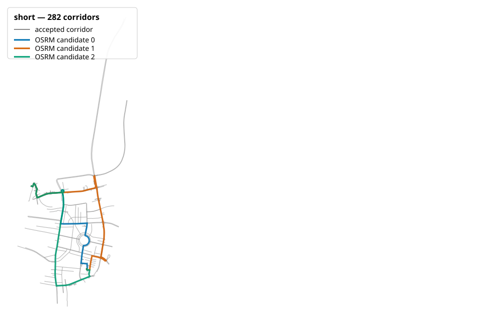
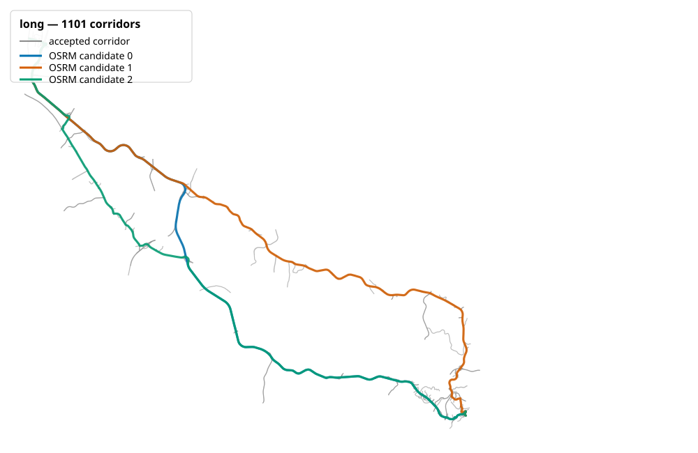
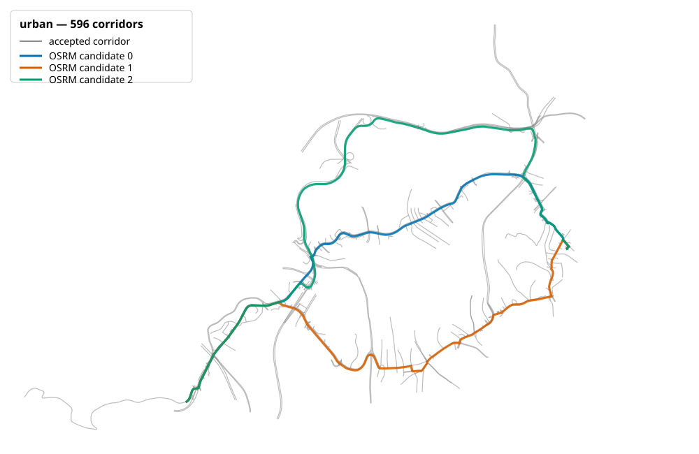
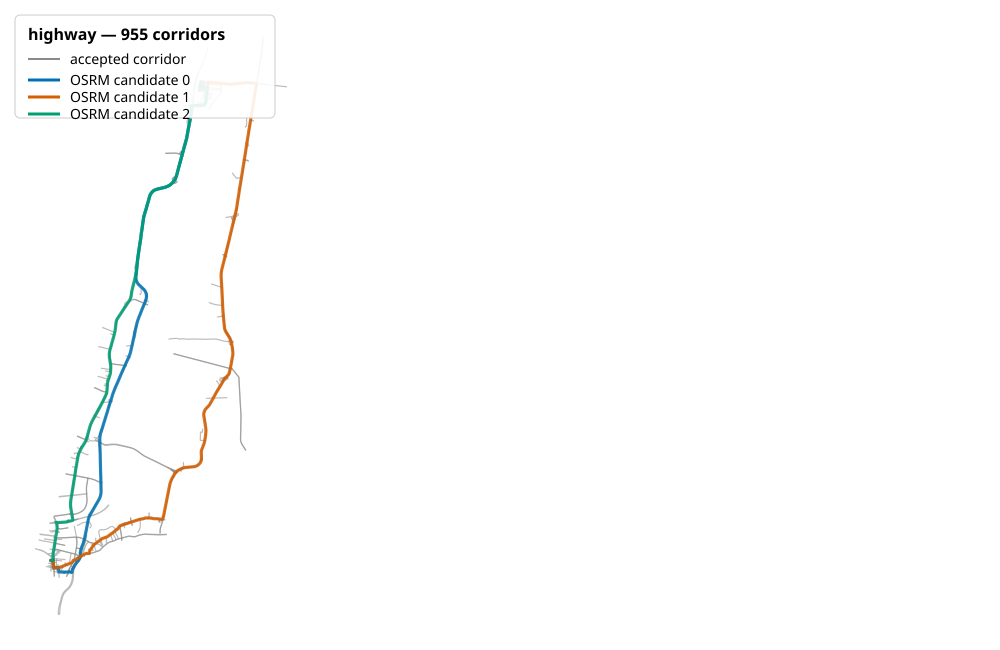
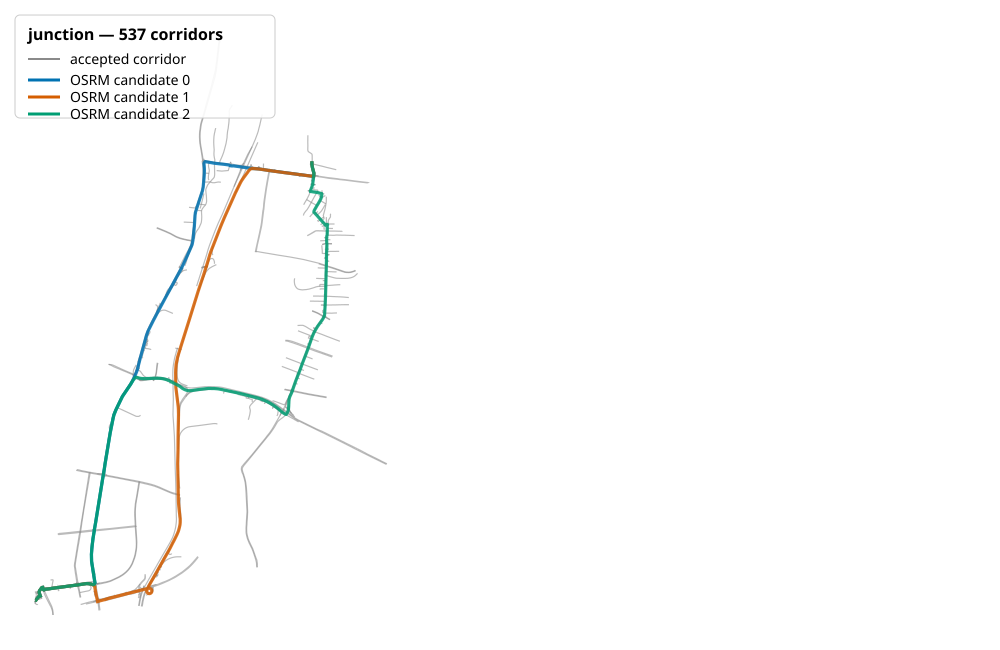
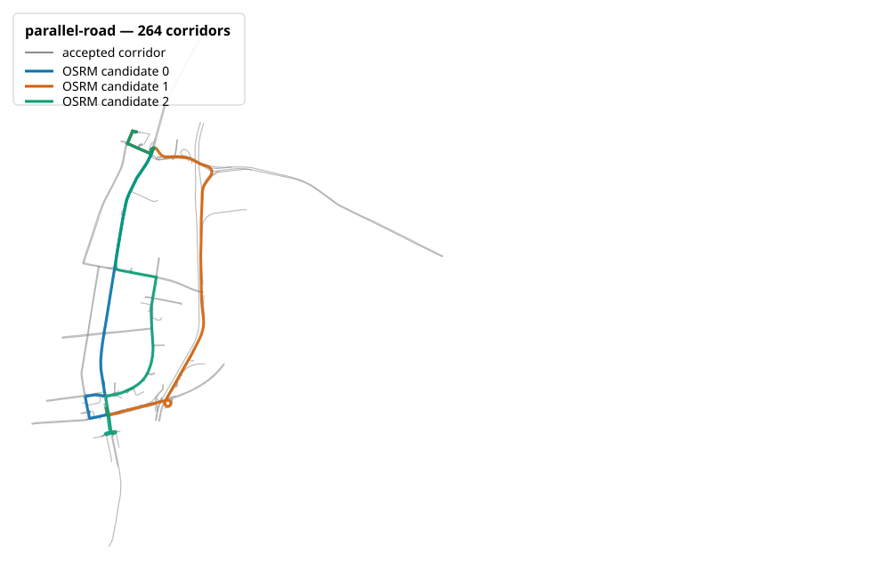

# Corridor matcher selection

## Decision

Use `sampled-nearest-v1`: one midpoint per 100 metres, a 30 metre acceptance tolerance,
deterministic nearest-corridor assignment, and an 80% low-coverage warning threshold. All three
candidates are parsed and transformed once, sampled once, and matched in one PostGIS statement.
Indexed 1 km route chunks preselect nearby corridors. Exact distance followed by `corridor_id`
breaks ties, so one sample cannot contribute to two parallel corridors.

The exact buffered-overlap prototype was rejected and removed after this comparison. It scored
the supplied candidate set in one indexed PostGIS statement and passed the hand-written
uniqueness example, but a genuine three-candidate long route remained active for more than four
minutes before cancellation. It therefore failed both route-length tiers by a large margin. The
sampled matcher is the only selected implementation in application code.

## Reproducible inputs

- OSRM image: `ghcr.io/project-osrm/osrm-backend:v6.0.0` with digest
  `sha256:729461bcc9ae9e6aafa92c0f93db9b060a32e85d5e72092c01ae4a4a9f1eb564`
- Graph: `israel-palestine-2026-07-31-osrm-6.0.0-profile-v1`
- OSM PBF SHA-256: `e9b3db1a669140565f75c05a1483f054b7f0df695ce483681791f84cfb80802a`
- Frozen corpus: `backend/tests/fixtures/representative_route_corpus.json`
- Every case contains exactly three full-GeoJSON candidates returned by the genuine local graph.
- PostgreSQL 16.4 and PostGIS 3.4.3 used the national corridor-risk table.
- Host: Apple M5, 16 GiB RAM, ARM64, Docker Desktop 29.6.2.
- The `postgis/postgis:16-3.4` database ran as AMD64 under Docker emulation on the ARM64 host.
- PostgreSQL JIT was disabled. `EXPLAIN ANALYZE (BUFFERS)` showed LLVM startup dominated these
  bounded spatial statements when JIT was enabled.

The retained plan's long-case profile generated 1,977 samples and performed 198 indexed chunk
preselection scans. Before the final tier decision, its total execution time was 2,716.7 ms;
the remaining cost was sorting the preselected wide corridor geometries. KNN, global
preselection, ID refetch, 5 km chunks, and per-chunk geometry-array variants were slower or
timed out, so the simpler 1 km plan was retained.

## Thirty-repeat warm benchmark

Each measurement scores exactly three candidates. One unrecorded warm-up precedes 30 recorded
warm executions. Every statement has a 10-second PostgreSQL statement timeout and transaction
cleanup. A final `pg_stat_activity` check reported zero orphan queries.

| Case | Candidate distances (km) | Warm p50 (ms) | Warm p95 (ms) | Gate | Result |
| --- | --- | ---: | ---: | --- | --- |
| Short | 4.75 / 5.91 / 5.35 | 173.75 | 213.63 | <1,500 ms | Pass |
| Long | 65.88 / 66.75 / 64.98 | 2,728.06 | 2,953.63 | <5,000 ms | Pass |
| Urban | 8.09 / 8.47 / 10.51 | 749.82 | 930.11 | <1,500 ms | Pass |
| Highway | 33.26 / 38.84 / 31.47 | 836.75 | 1,084.61 | <1,500 ms | Pass |
| Junction | 12.98 / 13.72 / 14.71 | 373.86 | 449.22 | <1,500 ms | Pass |
| Parallel road | 6.51 / 7.78 / 7.86 | 208.94 | 255.05 | <1,500 ms | Pass |

The genuine long and highway cases were retained without shortening. No full background-job
claim is made here; typical and long full-job targets are measured separately by the final
end-to-end validation ticket.

## Accuracy and stability

The disposable PostGIS fixture verifies calculated scores for full overlap, partial use, gaps,
parallel corridors, an intersection, no match, multiple candidates, and use of one kilometre of
a ten-kilometre corridor. It also verifies that coverage remains in 0-100%, assigned length does
not exceed OSRM distance, parallel candidates are not double counted, and a two-metre synthetic
shift leaves score and coverage unchanged.

All real candidates reported effectively 100% coverage before and after an approximately
two-metre diagonal geometry shift. The candidate with the lowest accident score remained the
same in all six cases. Raw score sensitivity is recorded because nearest-carriageway assignment
can change in dense parallel networks:

| Case | Largest absolute candidate-score change | Lowest-score candidate stable? |
| --- | ---: | --- |
| Short | 27.7% | Yes |
| Long | 3.9% | Yes |
| Urban | 7.3% | Yes |
| Highway | 24.8% | Yes |
| Junction | 14.5% | Yes |
| Parallel road | 9.9% | Yes |

This is acceptable for the version-1 historical-density proxy: coverage and the safest ordering
winner are stable, while the report exposes rather than conceals sensitivity near divided and
parallel roads. The formula is not a crash probability.

The selected 80% warning threshold is exercised by the synthetic gap case: 73.3% coverage emits
the warning, while complete and partial-route cases whose available geometry is fully matched do
not. This makes a missing fifth of route distance visible without rejecting otherwise useful
results.

Average-density prorating is acceptable for version 1. If one kilometre of a ten-kilometre
corridor with 100 historical accidents is used, the matcher contributes 10 accidents. This
explicitly assumes uniform density within the corridor. Precomputed smaller risk sections would
improve local precision later, but are not required for the version-1 historical proxy.

## Visual review

Gray lines are canonical risk corridors accepted by the 30 metre route-level preselection;
blue, orange, and green are the three fixed OSRM candidates. All six reviews show candidates
following available corridors. The junction and parallel-road cases visibly exercise nearby
alternatives without duplicate route length.

| Short | Long |
| --- | --- |
|  |  |

| Urban | Highway |
| --- | --- |
|  |  |

| Junction | Parallel road |
| --- | --- |
|  |  |

## Commands

```bash
docker run --rm --network ticket4national_default --env-file .env.test \
  -e MATCHER_CORPUS_PATH=/app/tests/fixtures/representative_route_corpus.json \
  -e MATCHER_BENCHMARK_REPEATS=30 \
  -e MATCHER_STATEMENT_TIMEOUT_MS=10000 \
  ticket5-benchmark:temporary python -m app.benchmark_corridor_matchers

docker compose --env-file .env.test -p ticket5matcher \
  -f compose.yaml -f compose.test.yaml run --build --rm corridor-matcher-tests
```

## Ticket 13 real-OSRM exclusion smoke (manual, 2026-08-03)

The pinned local graph and profile were served with `osrm-routed --algorithm mld` and queried
using all six cases in `backend/tests/fixtures/representative_route_corpus.json`. This is manual
deployment evidence, not authoritative automated coverage. Each request used full GeoJSON and
`alternatives=3`; one warm request preceded one measured request per case. The graph/image/profile
identity is `israel-palestine-2026-07-31-osrm-6.0.0-profile-v1`, OSRM `v6.0.0` digest
`729461…564`, and `osrm/road-risk-car.lua`.

| Exclusion | Candidate counts (short → parallel) | Median response | Max response | Result |
| --- | --- | ---: | ---: | --- |
| none | 3, 3, 3, 3, 3, 3 | 5.46 ms | 14.68 ms | pass |
| motorway | 3, 2, 2, 1, 1, 1 | 2.93 ms | 4.86 ms | pass |
| toll | 3, 2, 3, 3, 3, 3 | 2.57 ms | 3.13 ms | pass |
| motorway,toll | 3, 2, 2, 1, 1, 1 | 2.22 ms | 3.20 ms | pass |

Single-candidate responses are valid by the OSRM contract and correctly demonstrate that hard
exclusions can remove alternatives. The Ticket 5 PostGIS benchmark already records 100% normal
mode coverage and matcher performance. The same national PostGIS dataset was not available in
this smoke container, so exclusion-mode coverage was not recomputed here; the real deployment
must rerun the matcher benchmark for each exclusion mode before any broader performance claim.
